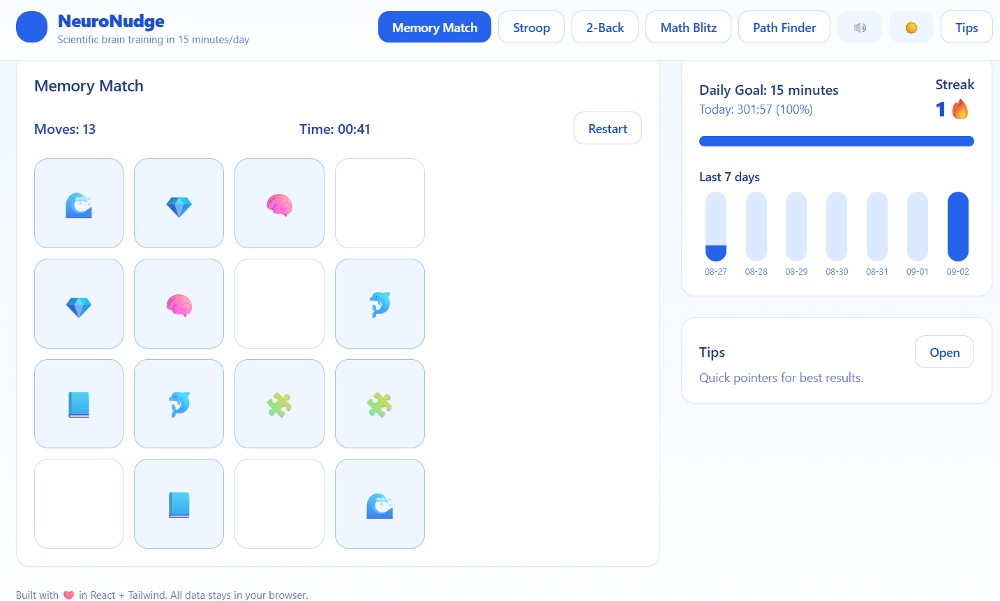
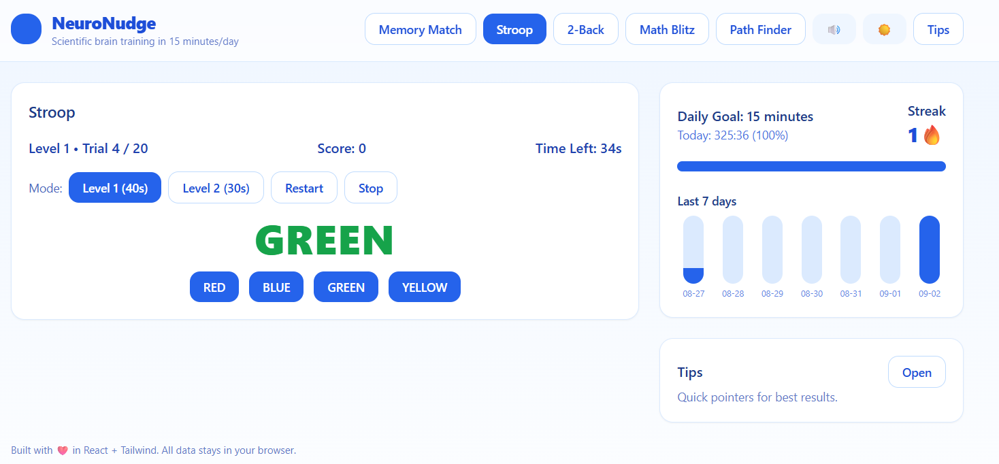
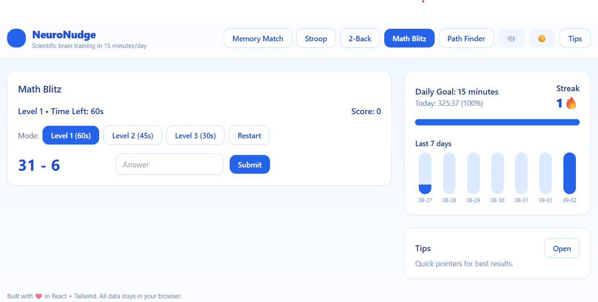
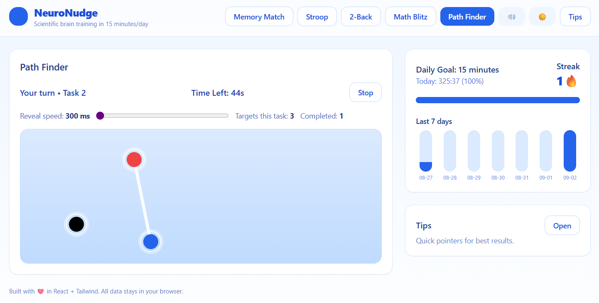

# NeuroNudge

NeuroNudge is a React-based brain-training platform offering Stroop, 2-Back, Memory Math, Math Blitz, and Path Finder modules. Designed for quick sessions, clean UI, and repeatable practice to sharpen attention, working memory, and mental agility.

[](https://suniltyagi.github.io/neuro-nudge/)
[](https://github.com/suniltyagi/neuro-nudge/actions/workflows/ci.yml)


---

## ✨ Features
- Stroop test with start/stop and adjustable levels
- 2-Back module with 60-second reverse timer
- Memory Math and Math Blitz modules
- Path Finder module
- Consistent UI controls across modules
- Keyboard and click interactions
- Lightweight, Create React App (CRA) baseline

---

## 🚀 Quick Start

```bash
npm install
npm start
```

Open [http://localhost:3000](http://localhost:3000) in your browser.

### Scripts
```bash
npm start       # dev server (CRA)
npm run build   # production build to /build
npm test        # jest/react-scripts tests
npm run lint    # eslint
```

---

## 🧭 Project Structure
```
src/
  components/
  hooks/
  styles/
  NeuroNudge.jsx
public/
```

---

## 📦 Tech Stack
- React 18 + CRA (react-scripts)
- ESLint + Prettier
- GitHub Actions CI

---

## 🖼 Screenshots

| Memory Match | Stroop Test |
|--------------|-------------|
|  |  |

| 2-Back Gameplay | Math Blitz |
|-----------------|------------|
|  |  |

| Path Finder |
|-------------|
|  |

---

## 🗺 Roadmap
- [ ] Add difficulty presets
- [ ] Results history & export
- [ ] Mobile-first refinements

---

## 🤝 Contributing
See [CONTRIBUTING.md](CONTRIBUTING.md).

---

## 🔒 Security
See [SECURITY.md](SECURITY.md).

---

## 📄 License
MIT © Sunil Tyagi
